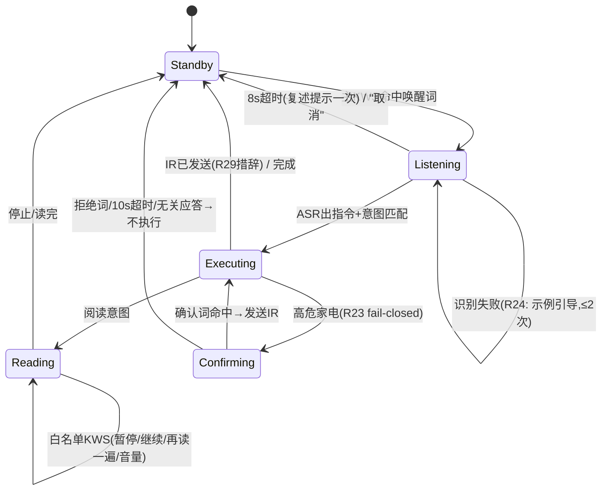
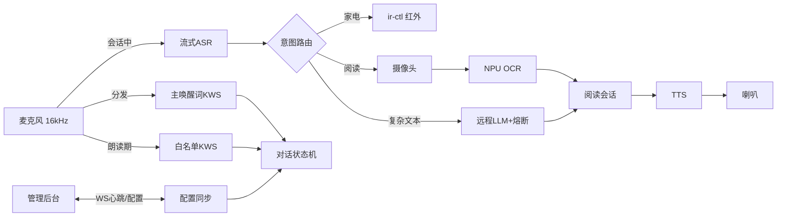

# LIRA Phase 1 — 设备端软件 + 子女管理后台

## Summary

基于 Orange Pi 5（RK3588S）构建 LIRA 设备端软件：单进程 asyncio 编排器，串联 sherpa-onnx 语音全栈（KWS 唤醒词 → 流式 ASR → 意图路由 → TTS）、PP-OCRv4 阅读管线、gpio-ir 红外家电控制，核心交互由带白名单命令的对话状态机驱动；配套 FastAPI + SQLite 子女管理后台（Web + token 鉴权），设备经 WebSocket 心跳拉取配置。开发策略为软件先行：x86 开发机 + 硬件抽象层 mock 跑通全流程（U1–U9），硬件到位后独立做板上 bring-up（U10）。

---

## Problem Frame

低视力老人无法独立完成读纸质材料和操作红外家电（见 origin Problem Frame）。本计划解决 HOW：在成品开发板上以本地优先架构交付需求 R1–R32，断网时核心功能不中断，高危家电在本地 fail-closed。

---

## Requirements

- R1–R32：全部继承 origin 需求文档（`docs/brainstorms/2026-09-26-lira-requirements.md`），以 origin 为唯一行为权威。关键分组：阅读辅助（R1–R4）、家电控制（R5–R8）、调度与网络（R9–R11）、隐私安全（R12–R13）、后台（R14–R15、R30、R32）、对话状态机（R16、R20–R29、R31）。R19（物理隐私按键）经 2026-09-27 决议作废。

**Origin actors:** A1 老人用户、A2 子女/管理者、A3 远程大模型服务
**Origin flows:** F1 纸质阅读、F2 家电控制（含高危确认）、F3 网络降级
**Origin acceptance examples:** AE1–AE7（集成测试 U9 的验收基线）

---

## Scope Boundaries

- 药盒/物体识别等低视力视觉辅助（Phase 3）；硬件预留接口但不实现。
- 外壳、量产化、PCB；家电状态回读（红外单向）。
- 后台公网暴露、反向代理 TLS、多子女账号体系（单管理员凭据 + 设备 token 即可）。
- Home Assistant / OVOS 等现成语音框架集成（借鉴其管线形态，不引入依赖）。

### Deferred to Follow-Up Work

- 金镜像（golden image）自动化构建管线：U10 先以文档化步骤交付，自动化脚本后续迭代。
- 报纸版面"第 N 版共 M 版"进度播报：依赖版面分析成熟度，Phase 1 仅分块朗读。

---

## Context & Research

### Relevant Code and Patterns

- Greenfield 项目，无既有代码。模块边界借鉴 Home Assistant Assist / Wyoming 管线形态（唤醒→VAD→STT→意图层→Agent→TTS），本地意图规则优先、LLM 兜底。

### External References

- RKNN 模型仓库（PP-OCRv4 det/rec，RK3588 现成）：github.com/airockchip/rknn_model_zoo `examples/PPOCR/`；PP-OCRv5 转 RKNN 当前损坏，禁用。
- sherpa-onnx：KWS `sherpa-onnx-kws-zipformer-zh-en-3M`（拼音 keywords 文件自定义唤醒词，免训练）；流式 ASR `streaming-zipformer-bilingual-zh-en`；TTS `matcha-icefall-zh-baker` + `vocos-22khz` vocoder（备选 `vits-icefall-zh-aishell3`）。
- RKNN 版本三件套必须匹配：内核驱动 ≥0.9.8 / librknnrt / x86 rknn-toolkit2（2.3.x 线）。
- 红外：内核 `gpio-ir` + `gpio-ir-tx-transmitter` DT overlay + `ir-ctl -r/-s` 原始码；LIRC 弃用；Python 不能产生 38kHz 载波。
- openai SDK v1+（base_url 覆盖实现 OpenAI 兼容可配置端点）；SDK 默认 `max_retries=2` 且会自动重试超时与连接错误，设备端**显式设置 `max_retries=0`**，把重试语义完全收归熔断器（避免隐藏重试拖垮 R28 的 2 秒等待反馈与熔断计数）；`APITimeoutError` 由熔断器统一计数处理。
- FastAPI OAuth2/JWT 官方教程模式；PyJWT + bcrypt；SQLite WAL 模式。

---

## Key Technical Decisions

- **单进程 asyncio 编排器**：所有设备端能力为一个 Python 进程，模块按管线阶段划分（audio/dialog/vision/appliances），边界保持可拆分（Wyoming 形态）。理由：单机专用设备，多服务复杂度不值。
- **硬件抽象层（HAL）**：`Camera`/`AudioIO`/`IrController`/`Button`/`Display` 五个接口，x86 mock 实现与板上真实实现共存，由配置选择。理由：软件先行开发的关键。
- **语音全栈 sherpa-onnx（CPU）**：与 NPU OCR 无资源冲突；KWS 常驻单线程可绑 A55 核。音频统一 16kHz 单声道，`sounddevice` 单实例采集后分发给 KWS 与 ASR 两路流。
- **朗读期白名单 KWS（R21 的结构性实现）**：TTS 播放期间关闭完整 ASR 与唤醒词，仅运行第二个 KWS 实例识别 {暂停/继续/停止/再读一遍/大声点/小声点}；播放音频绝不进入意图通道 → AE4 由构造保证。
- **意图路由三级**：本地规则（家电/阅读/帮助/播放控制）→ 本地 LLM 规则外任务 → 远程 LLM；高危确认是本地规则层的一部分，永不经 LLM。
- **降级 = 只读原文（R27）**：远程不可用时朗读本地 OCR 原文 + 免责提示，不拒读。
- **后台**：FastAPI + SQLite(WAL, `synchronous=FULL`) + Jinja2/HTMX（无 Node 构建链）；单管理员 bcrypt + JWT；设备用独立 device token（HTTP header）+ WebSocket 心跳（60s）同步配置。
- **后台鉴权细化（安全评审结论）**：管理员会话用 cookie（HttpOnly + SameSite=Strict）而非 localStorage JWT——HTMX 页面无 JS 管 token，cookie 天然防 XSS 窃取，配 CSRF token 中间件；JWT 带撤销计数（改密码/吊销使旧会话失效）。管理员凭据走首启引导（环境变量或首次访问强制设置，禁止空默认密码硬编码）；登录接口限速（失败 5 次锁 5 分钟）。设备 device token 用 `secrets.token_urlsafe` 生成、库中只存哈希；WS 连接首帧必须先出示 token 才允许后续消息。
- **配置同步 = 全量快照 + (epoch, version) 键（数据完整性评审结论）**：设备拉取的是**全量配置快照**而非 delta；版本键为 `(epoch, version)` 二元组——epoch 在后台数据库重建/恢复时重新生成，防旧 delta/旧版本号在新库上被误判为"已应用"（禁用取暖器的配置被回放覆盖是安全事故，不是 bug）。设备应用快照须原子（事务整体提交）且幂等（重复收到同 (epoch, version) 直接跳过）；应用后回执版本号。安全关键变更（高危禁用、隐私切换）后台在设备在线时经 WS **立即推送**，60s 心跳拉取仅作离线兜底（R30 的"60 秒内"按推送路径达成）。
  **epoch 迁移（2026-09-27 决议：取消配对流程，改为开发期预置）**：后台库重建时设备注册关系与 epoch 同时失效，恢复同步走**开发期预置**——设备端配置文件写入 device token；epoch 换新后由开发者在设备端执行 `python -m lira.sync reset-sync <db>`（仅清 (epoch, version) 元数据，保留本地配置与已学红外码），设备重启后按 bootstrap 语义接受新 epoch 快照。运行期任何陌生 epoch 快照一律拒绝（回放保护不变）。这样既不出现"设备永久冻结在旧安全配置"（同步坏死有明确的手工恢复路径），也不出现"设备接受任何未见过的 epoch"（回放保护失效）。
- **本地安全底线（safety floor，不可被配置触碰）**：高危设备的二次确认逻辑本身（R6/R23）是代码常量，后台配置只能"禁用设备"或"标记/取消高危标记"——不存在任何让高危设备跳过确认的配置路径；设备端应用快照时校验此不变量，违规快照拒绝并告警。
- **OCR 双后端**：`OcrEngine` 接口，x86 用 PaddleOCR/onnxruntime（开发期），板上用 RKNNLite 加载 .rknn；业务代码无感知。
- **红外原始码方案**：学习 = `ir-ctl -r` 录原始 pulse/space 存库；回放 = `ir-ctl -s`；空调按"整状态帧"学习（每种目标状态学一帧），不做状态组合。

---

## Open Questions

### Resolved During Planning

- OCR 选型 → PP-OCRv4 mobile（zoo 现成，v5 不可用）
- 唤醒词方案 → sherpa-onnx KWS 拼音表
- ASR/TTS 模型 → zipformer 流式 / matcha+vocos
- 后台形态与鉴权 → Web + token（用户决议 2026-09-26）
- 播放期 ASR 冲突（origin G4/AE4 机制空白）→ 白名单 KWS 结构性解决（用户决议）

### Deferred to Implementation

- 唤醒词具体词语（拼音表驱动，改词零成本；建议"小丽拉"或类似 4 音节词，实测误触率后定稿）。
- KWS 阈值（`keywords_score`/`keywords_threshold`）、ASR RTF、TTS 速度参数：板上实测调优，先取官方默认。
- 报纸多栏排序启发式规则：用真实报纸样本调试（origin 遗留 Technical 项）。
- 熔断降级参数初值：失败阈值 3 次 / 冷却 60s 起步，运行期调整。

---

## Output Structure

    lira/
    ├── docs/
    │   ├── brainstorms/2026-09-26-lira-requirements.md
    │   └── plans/2026-09-26-001-feat-lira-phase1-device-backend-plan.md
    ├── device/
    │   ├── pyproject.toml
    │   ├── lira/
    │   │   ├── config.py            # YAML+env 配置加载（LLM endpoint 可配置）
    │   │   ├── main.py              # asyncio 入口，装配各模块
    │   │   ├── hal/
    │   │   │   ├── base.py          # Camera/AudioIO/IrController/Button/Display 接口
    │   │   │   ├── mock/            # x86 开发实现（假摄像头目录/文件音频/日志红外）
    │   │   │   └── board/           # 板上实现（U10 填充）
    │   │   ├── audio/
    │   │   │   ├── mic.py           # sounddevice 采集 → 分发
    │   │   │   ├── kws.py           # 唤醒词 KWS（可多实例：主唤醒词/白名单）
    │   │   │   ├── asr.py           # 流式 ASR 封装
    │   │   │   └── tts.py           # TTS 封装（语速/音量，规则 FST）
    │   │   ├── dialog/
    │   │   │   ├── state_machine.py # STANDBY/WAKE/LISTENING/CONFIRMING/READING...
    │   │   │   ├── intents.py       # 本地意图规则（家电/阅读/帮助/播放控制）
    │   │   │   └── router.py        # 本地规则 → 远程 LLM 三级路由
    │   │   ├── vision/
    │   │   │   ├── engine.py        # OcrEngine 接口
    │   │   │   ├── ocr_x86.py       # PaddleOCR/onnxruntime 后端
    │   │   │   ├── ocr_rknn.py      # RKNNLite 后端（U10 激活）
    │   │   │   ├── layout.py        # 多栏排序启发式
    │   │   │   └── reading.py       # 阅读会话（缓存/分块/暂停恢复）
    │   │   ├── llm/
    │   │   │   ├── client.py        # OpenAI 兼容客户端（streaming）
    │   │   │   └── breaker.py       # 熔断降级 + 隐私拦截
    │   │   ├── appliances/
    │   │   │   ├── models.py        # 设备/场景/安全规则模型（SQLite 持久化）
    │   │   │   └── ir.py            # ir-ctl 学习/回放封装
    │   │   ├── privacy.py           # 隐私模式一等状态（麦克风+上传+UI 开关）
    │   │   ├── ui/                  # 设备端 Web UI（局域网浏览器访问）
    │   │   └── sync.py              # 与后台 WS 同步：全量快照 (epoch,version)、幂等事务应用、安全底线校验
    │   └── tests/
    ├── backend/
    │   ├── pyproject.toml
    │   ├── app/
    │   │   ├── main.py              # FastAPI 入口
    │   │   ├── auth.py              # 管理员 JWT + 设备 token
    │   │   ├── models.py            # SQLModel
    │   │   ├── api/                 # 设备/家电/安全规则/学习模式 API
    │   │   └── templates/           # Jinja2+HTMX 页面
    │   └── tests/
    ├── assets/
    │   └── keywords/                # 唤醒词/白名单拼音表
    ├── deploy/
    │   ├── dt-overlays/             # gpio-ir / gpio-ir-tx 设备树 overlay
    │   └── system/                  # log2ram、journal、thermal 配置
    └── models/                      # 模型文件下载脚本（不入库，.gitignore）

---

## High-Level Technical Design

> *This illustrates the intended approach and is directional guidance for review, not implementation specification. The implementing agent should treat it as context, not code to reproduce.*

### 对话状态机

### 组件数据流

---

## Implementation Units

### U1. 项目脚手架、配置系统与硬件抽象层

**Goal:** 建立双包仓库骨架（device/backend）、配置加载（含 OpenAI 兼容端点 base_url/api_key/model 可配置）、HAL 五接口 + x86 mock 实现。

**Requirements:** R9（HAL 支撑本地优先）、配置可切换 LLM 端点（Key Decisions）

**Dependencies:** None

**Files:**
- Create: `device/pyproject.toml`、`backend/pyproject.toml`、`lira/config.py`、`lira/main.py`、`lira/hal/base.py`、`lira/hal/mock/*`、`models/download_models.py`、`.gitignore`、`README.md`
- Test: `device/tests/test_config.py`、`device/tests/test_hal_mock.py`

**Approach:**
- 配置分层：`config.yaml` 默认值 + 环境变量覆盖（`LIRA_LLM_BASE_URL` 等）；隐私模式、高危设备表等运行时可变状态不入配置文件（入库/内存）。
- HAL 接口设计为 async 上下文管理器；mock 摄像头从 `assets/mock_images/` 取图，mock 音频从 wav 文件读，mock IR 只写日志。
- `models/download_models.py` 一次性下载 sherpa-onnx 三个模型 + PP-OCR 模型到 `models/`（gitignore）。

**Test scenarios:**
- Happy path: 加载完整 config.yaml → 各字段就位，LLM base_url 默认 GLM 兼容端点。
- Edge case: 环境变量覆盖 yaml 值；缺失必填项（如 api_key）时给出明确报错。
- Happy path: mock camera 连拍两图返回不同文件内容；mock IR send 记录码值到内存列表。

**Verification:** `python -m lira.main --dry-run` 能以全 mock HAL 启动并打印模块装配图后退出。

---

### U2. 音频管线：采集、唤醒词、流式 ASR、TTS

**Goal:** sherpa-onnx 全栈封装：`sounddevice` 单实例采集分发到 KWS/ASR 双流；唤醒词 KWS 常驻；流式 ASR 出文本；TTS 带语速/音量与规则 FST（数字/日期正确读法）。

**Requirements:** R16、R18（TTS 降级可接受）、R25（唤醒反馈的音频部分）

**Dependencies:** U1

**Files:**
- Create: `lira/audio/mic.py`、`lira/audio/kws.py`、`lira/audio/asr.py`、`lira/audio/tts.py`、`assets/keywords/wakeword_raw.txt`
- Test: `device/tests/test_audio_stack.py`

**Approach:**
- KWS 类支持多实例（同一模型、不同 keywords 文件）：主唤醒词实例 + U3 用的白名单实例；命中后必须 `reset_stream`。
- TTS 封装提供 `speak(text, speed, volume)` 返回完成事件；实现半双工保护钩子（播放时向状态机广播"占用中"事件）。
- x86 开发机用 USB 耳机麦即可真跑（sherpa-onnx 跨平台）；mock AudioIO 备用（CI 无声卡时用 wav 注入）。

**Test scenarios:**
- Happy path: 注入含唤醒词发音的 wav → KWS 命中并 reset。
- Edge case: 注入不含唤醒词的 1 分钟环境音 → 零误触发（阈值默认值下）。
- Happy path: TTS 生成中文含数字/日期文本 → 产出音频时长 > 0 且完成事件触发。
- Integration: mic 分发器同时喂 KWS 与 ASR，两流互不丢帧（计数断言）。

**Verification:** x86 开发机上对着 USB 麦说唤醒词，终端打印命中日志；TTS 从喇叭播出一段中文。

---

### U3. 对话状态机与意图路由（核心交互逻辑）

**Goal:** 实现 origin 对话状态机全图：会话模型（R20）、聆听窗口与超时（R25）、识别失败引导重试（R24）、高危 fail-closed 确认（R23）、朗读白名单命令（R21/R22）、帮助指令（R31）、意图隔离与三级路由。

**Requirements:** R11、R16、R20–R25、R29、R31

**Dependencies:** U2

**Files:**
- Create: `lira/dialog/state_machine.py`、`lira/dialog/intents.py`、`lira/dialog/router.py`、`assets/keywords/playback_whitelist_raw.txt`、`lira/dialog/phrasebook.py`（所有语音话术集中管理，含免责提示文案）
- Test: `device/tests/test_state_machine.py`、`device/tests/test_intents.py`、`device/tests/test_router.py`

**Approach:**
- 纯逻辑状态机，无 I/O：动作通过回调接口（`speak`/`capture_and_read`/`send_ir`/`start_listening`）注入 → 可全面单测。**Execution note: 本单元测试先行，先写状态机迁移表测试再实现。**
- 白名单 KWS 在进入 READING 态时激活、退出时停用，由状态机统一切换音频路由（KWS/ASR/白名单KWS 三选二）。
- 高危确认：确认集/拒绝集词表匹配（本地规则层），无关应答复述一次后取消；计时器 10s。
- `phrasebook.py` 集中所有播报话术（R24 引导语、R27/R3 免责语、R28 等待语、R29 发送措辞），方便统一审校。

**Test scenarios:**
- Covers AE3. Happy path: 高危设备指令 → 进入 CONFIRMING → "确认" → `send_ir` 被调用且参数正确。
- Covers AE3. Error path: CONFIRMING 态应答"今天天气怎么样" → 复述一次 → 再次无关 → 取消，`send_ir` 未被调用；10s 超时同理。
- Covers AE4. Integration: READING 态注入白名单外文本音频 → 无意图触发；注入"暂停" → 朗读暂停事件。
- Covers R20. Happy path: 唤醒 → 指令 → 完成 → 自动回 Standby；完成后再说话（无唤醒词）→ 不响应。
- Covers R24. Happy path: 两次无匹配指令 → 第 3 次礼貌回待机；每次均有引导话术回调记录。
- Covers R25. Error path: 唤醒后 8s 无语音 → 复述提示 → 再超时 → Standby。
- Covers R31. Happy path: "你能做什么" → 播报能力清单文案。
- Edge case: 会话中"取消" 从任意态回 Standby。

**Verification:** 状态机迁移表测试全绿；x86 + mock 音频走通"唤醒→开空调→确认→发送"全流程。

---

### U4. OCR 阅读管线

**Goal:** 拍摄→OcrEngine→多栏排序→分块阅读会话（缓存、暂停/继续/再读一遍、块间白名单命令），含拍摄语音引导（R4）与 OCR 失败路径（R26）。

**Requirements:** R1、R2（本地部分）、R4、R21、R22、R26

**Dependencies:** U1（HAL Camera）、U2（TTS）、U3（状态机 READING 态）

**Files:**
- Create: `lira/vision/engine.py`、`lira/vision/ocr_x86.py`、`lira/vision/layout.py`、`lira/vision/reading.py`
- Test: `device/tests/test_layout.py`、`device/tests/test_reading.py`

**Approach:**
- `OcrEngine.detect(image) -> boxes+text` / `recognize(crop) -> text`；x86 后端用 PaddleOCR mobile 模型经 onnxruntime（与板上 .rknn 输入输出约定对齐：det 480px 长边限制）。
- `layout.py` 按 det 多边形 x 坐标聚类列、列内按 y 排序 → 阅读顺序；用真实报纸照片样本测试（`assets/mock_images/` 放 2–3 张样张）。
- 阅读会话持有缓存文本+位置游标，支持 seek 到块边界；"再读一遍"重复当前块（R22，不重新拍摄）。

**Test scenarios:**
- Happy path: 单栏信件样张 → 识别文本顺序正确。
- Edge case: 三栏报纸样张 → 阅读顺序按列分组（左列读完读右列）。
- Error path: 空白/糊图 → `engine` 返回空结果 → 状态机收到"未检出"信号走 R26 引导话术。
- Happy path: 朗读中"暂停"→"继续" → 从暂停块继续；"再读一遍"重复当前块且不触发 camera 调用（mock 计数断言）。

**Verification:** x86 上拍摄真实报纸照片，产出正确排序的文本并分块朗读。

---

### U5. LLM 客户端与网络降级

**Goal:** OpenAI 兼容客户端（可配置端点、streaming）、熔断降级器、隐私上传拦截、复杂文本转白话 prompt 与免责拼装（R27/R28/R3）。

**Requirements:** R2、R3、R10、R27、R28

**Dependencies:** U1（配置）

**Files:**
- Create: `lira/llm/client.py`、`lira/llm/breaker.py`、`lira/llm/prompts.py`（转白话 system prompt + 免责文案）
- Test: `device/tests/test_llm_client.py`、`device/tests/test_breaker.py`

**Approach:**
- `openai` SDK `AsyncOpenAI(base_url=cfg..., timeout=..., max_retries=0)`（SDK v1+ 默认重试超时/连接错误，必须显式归零，重试语义归熔断器）；`APITimeoutError` 由熔断器计数。
- 熔断器：连续失败 N 次（默认 3）开断路 60s，期间 `is_available()=False`；恢复后半开试探。联网检测与熔断状态合并为"远程可用性"单一信号喂给路由层（R10）。
- 隐私拦截在客户端入口：privacy ON 时所有远调用直接抛本地异常（fail-closed，R12/R21 中段切换也走这里）。
- 复杂文本判定：文本长度阈值 + 类别提示词（药品说明书等），阈值入配置。

**Test scenarios:**
- Happy path: mock OpenAI 服务（respx/本地 aiohttp stub）→ streaming 文本完整回收。
- Error path: 连续 3 次超时/连接错误 → 熔断打开 → `is_available()=False`；60s 后半开，成功即闭合。
- Covers AE1. Edge case: privacy ON 时调用远端 → 立即本地异常，网络层零请求（计数断言）；隐私中途关闭不改变已拦截结果。
- Happy path: 长文本 → 转白话结果 + 免责语句拼装顺序正确。

**Verification:** 用真实 GLM 端点（用户提供的 key）跑通一次转白话；断网（断开代理）后熔断降级路径正确。

---

### U6. 红外家电控制

**Goal:** ir-ctrl 学习/回放封装（经 HAL IrController）、设备/场景/安全规则模型与本地持久化、高危规则与黑名单本地生效、设备端与后台的配置同步（`lira/sync.py`，R30 设备侧）。

**Requirements:** R5、R6、R7、R8、R13、R30（设备侧）、R32

**Dependencies:** U1（HAL）、U3（状态机确认流程）

**Files:**
- Create: `lira/appliances/models.py`、`lira/appliances/ir.py`、`lira/appliances/store.py`（SQLite 本地库）、`lira/sync.py`（设备端同步：WS 客户端、全量快照 (epoch,version) 原子幂等应用、安全底线不变量校验、同步状态重置 CLI 供开发期 epoch 迁移）
- Create: `deploy/dt-overlays/gpio-ir-overlay.dts`（含 RX/TX 节点，文档化编译步骤）
- Test: `device/tests/test_appliance_models.py`、`device/tests/test_ir.py`、`device/tests/test_sync.py`

**Approach:**
- 设备模型：名称、别名（语音匹配词）、码值（原始 pulse/space）、is_high_risk、enabled；场景 = 设备动作列表。SQLite（WAL，`synchronous=FULL`）持久化（R13）——安全规则库丢失等同安全规则失效，写放大可接受（写入低频）。码值入库用 UPSERT（重学习覆盖同设备+动作），删除设备级联删除其码值与场景引用（防悬挂引用）。
- 语音匹配：别名唯一命中才执行；零命中走"未配置"话术；多命中不猜（应答澄清）——对应流程分析 G12。
- 发送前本地校验安全底线：`is_high_risk and not confirmed` → 拒发（状态机层校验之外的最后一道闸，`send_ir` 内部再查 enabled/high-risk，双层 fail-closed）。
- 学习流程由后台发起（R32）：后台发"进入学习模式+设备+动作名"→ 设备录一帧原始码 → 回传码值入库。
- 设备端同步（`lira/sync.py`）：WS 客户端（首帧出示 token 鉴权，协议见 Key Technical Decisions 与 U8）；收到快照先校验安全底线不变量，再在单事务内原子应用（同 (epoch, version) 重复投递幂等跳过），应用后回执 `(epoch, version)`；心跳 60s 拉取兜底。**epoch 迁移走开发期预置**（设备端 `reset-sync` 清同步元数据后重拉快照，见 Key Technical Decisions），运行期陌生 epoch 一律拒绝。WS 传输层可注入（单元测试用 mock 传输，不依赖真实后台；与真实后台的联通在 U9 验证）。
- HAL mock 实现学习=从文件注入码值；板上实现调 `ir-ctl` 子进程（RX 录原始码，TX 回放）。

**Test scenarios:**
- Covers AE5. Happy path: 学习模式收到"音量+"码值 → 入库 → 之后语音"调大音量"命中并回放（mock 断言）。
- Happy path: 场景"睡觉模式"含 3 设备 → 逐项回放并逐项报告发送结果（R29 措辞）。
- Edge case: 语音指令匹配两个设备别名 → 不执行，话术请求澄清。
- Error path: 指令指向未配置设备 → "请家人在后台添加"话术。
- Error path: 对已禁用设备直接调 `send_ir`（绕过状态机的防御性测试）→ 抛本地异常、IR 未发射。
- Covers R30/AE7. Happy path（`test_sync.py`）: mock 传输注入全量快照 → 原子入库 → 回执 `(epoch, version)`；同版本重复投递 → 幂等跳过。
- Error path（`test_sync.py`）: 旧 epoch / 陌生 epoch 快照 → 拒绝应用、本地安全规则保持；出厂 bootstrap（本地无 epoch）接受首个快照；reset-sync 后新 epoch 接受且已学码值保留。
- Error path（`test_sync.py`）: 违反安全底线不变量的快照（试图给高危设备加"免确认"路径）→ 拒绝并告警。

**Verification:** x86 mock 全流程通；DT overlay 文档就绪待板上验证（真实收发在 U10）。

---

### U7. 隐私模式与设备端 Web UI

**Goal:** 隐私模式一等状态（麦克风关+上传拦截+播报后果）；设备 Web UI（局域网浏览器远程访问，设备无触摸屏；状态/设置/隐私开关，R17）。物理隐私按键已取消（2026-09-27 决议，R19 作废）。

**Requirements:** R12、R17、R30（本端应用部分）

**Dependencies:** U3（状态机）、U5（隐私拦截点）、U6（本地库）

**Files:**
- Create: `lira/privacy.py`、`lira/ui/app.py`、`lira/ui/templates/*`
- Test: `device/tests/test_privacy.py`、`device/tests/test_ui.py`

**Approach:**
- 隐私模式为全 app 广播的状态对象：`privacy.py` 发布 on/off 事件 → 音频层关麦、LLM 层拦截、状态机置不可唤醒；切换时 TTS 播报后果（含麦克风已关提示）。
- UI 用设备本地小 Web 服务（局域网浏览器访问；设备无触摸屏，状态反馈以语音为主），页面：状态卡（网络/远程可用/隐私）、隐私开关、音量、TTS 语速、设备列表只读。**开启/关闭隐私的 UI 路径需设备本地口令**（设备首次启动时经局域网 Web 界面设置，无默认值）。只读状态卡不鉴权。
- 日志纪律：ASR 识别文本、OCR 识别文本、LLM 往返内容**一律不落日志**（隐私模式之外也不落——设备记录的语音内容本身就是敏感面）；日志只记事件类型与耗时。

**Test scenarios:**
- Covers AE1. Happy path: 隐私 ON → KWS 不再命中（mock 音频注入验证）；隐私 OFF → 唤醒恢复 + 播报记录存在。
- Edge case: 隐私 ON 瞬间有在途远端请求 → 被拦截（U5 测试，此处验证事件广播次序）。
- Happy path: 后台同步的隐私开关与设备 UI 殊途同归（同一状态对象）。

**Verification:** 浏览器访问设备 UI 完成隐私开关。

---

### U8. 子女管理后台与设备通信

**Goal:** FastAPI + SQLite 后台：管理员登录（bcrypt+JWT）、设备注册与 device token、家电/安全规则/场景 CRUD、红外学习发起、隐私远程开关、设备状态查看（R14/R15/R26/R30/R32）。

**Requirements:** R7、R14、R15、R30、R32

**Dependencies:** U6（数据模型对齐）

**Files:**
- Create: `backend/app/main.py`、`backend/app/auth.py`、`backend/app/models.py`、`backend/app/api/devices.py`、`backend/app/api/appliances.py`、`backend/app/api/learn.py`、`backend/app/templates/*`
- Test: `backend/tests/test_auth.py`、`backend/tests/test_api.py`

**Approach:**
- 鉴权双通道：管理员浏览器走 cookie 会话（HttpOnly + SameSite=Strict + CSRF token，见 Key Technical Decisions）；设备走 `X-Device-Token` header——配置写入必须双向认证（防伪造"禁用"指令）。
- 管理员凭据首启引导：无凭据时首次访问强制进入设置页（或经环境变量注入），系统不存在空/默认密码状态；登录失败限速（5 次锁 5 分钟）；JWT 带撤销计数，改密码即全体会话失效。
- 设备 token：`secrets.token_urlsafe` 生成、库中只存哈希（泄露库文件不泄露 token）、可吊销重发；WS 连接握手后**首帧**必须出示 token，未认证前不处理任何消息。
- 配置同步协议（见 Key Technical Decisions）：全量快照 + `(epoch, version)` 键。后台每次配置变更 version+1、重建/恢复库时 epoch 换新；安全关键变更（禁用设备、高危标记、隐私切换）在设备在线时经 WS **立即推送**快照，心跳（60s）拉取仅兜底离线场景（R30）。设备回执 `(epoch, version)` 入库留痕。库重建后的 epoch 迁移走**开发期预置**（设备端 reset-sync，见 Key Technical Decisions）。
- 学习模式 = 后台下发指令 + WS 接收设备回传码值（回传同样走已认证 WS）。
- 简单页面：设备列表（在线/最后心跳/配置版本）、家电配置表单、高危标记开关、学习按钮、隐私开关。
- 运维面：后台 SQLite 文件权限 0600；LAN 明文 HTTP 的暴露面写入 `deploy/SETUP.md`（Phase 1 已知限制，见 Scope Boundaries）。

**Test scenarios:**
- Happy path: 管理员首启设置凭据 → 登录 → 创建设备 → 获得 token → 设备用 token 拉取全量快照。
- Error path: 无 token / 错 token 访问设备 API → 401；登录连续失败 5 次 → 第 6 次被限速拒绝。
- Covers AE7. Integration: 设备离线时禁用高危设备 → 版本+1 → 设备重连拉取快照 → 回执 `(epoch, version)`。
- Covers AE5. Integration: 发起学习 → 模拟设备回传码值 → 码值入库且版本+1。
- Error path: 向设备回放**旧 epoch** 的快照（模拟后台重建库后旧数据回流）→ 设备识别 epoch 不匹配、拒绝应用并保持本地安全规则。
- Error path: 同版本快照重复投递 → 设备幂等跳过，无重复播报（R30"应用关键变更时语音播报"只发一次）。
- Edge case: SQLite WAL 下后台写与设备读并发不阻塞。

**Verification:** 浏览器操作后台完成"添加家电→标记高危→禁用"，模拟设备端拉取到变更。

---

### U9. 端到端集成测试（模拟环境）

**Goal:** x86 + mock HAL 环境跑通 origin AE1–AE7 全部验收场景，作为 Phase 1 软件完成的定义。

**Requirements:** AE1–AE7 全覆盖

**Dependencies:** U2–U8

**Files:**
- Create: `device/tests/e2e/conftest.py`（全 mock 装配 fixture）、`device/tests/e2e/test_ae1_privacy.py` … `test_ae7_sync.py`
- Create: `device/tests/e2e/audio_fixtures/`（录制好的指令/唤醒/白名单 wav 样本）

**Approach:**
- 音频注入走 mock AudioIO 播放预录 wav；LLM 用本地 stub；后台用 testclient 起真实 app。
- 每条 AE 一个测试文件，断言跨模块副作用（IR mock 调用、TTS 播报记录、网络拦截计数）。
- **对抗性同步用例**（`test_sync_adversarial.py`，覆盖安全评审/数据完整性评审发现）：旧 epoch 快照回放、同版本重复投递、快照应用到一半崩溃（下次启动完整性校验）、后台库删除重建后 epoch 换新且设备不会误判"已最新"（运行期拒绝；设备端 reset-sync 后接受新 epoch 并恢复同步）、设备离线期间多次配置变更只取最终快照。

**Test scenarios:**
- 即 AE1–AE7 逐条落地（origin 为权威），每条至少含正常路径；AE3/AE4 加边界与失败路径。

**Verification:** e2e 测试套件全绿；`README.md` 记录一键运行方式。

---

### U10. 硬件 bring-up 与板上部署

**Goal:** 在 Orange Pi 5 实机完成：系统镜像与 RKNN 版本锁定、MIPI 摄像头、USB 麦阵、喇叭、GPIO 红外收发；用真实 HAL 实现替换 mock，实机复跑核心链路。（物理按键已取消，2026-09-27 决议，无 button_gpio。）

**Requirements:** R9 实机验证、R18（TF 寿命）、R5（真实红外）

**Dependencies:** U1–U9、**硬件物料采购到位**（含红外接收头）

**Files:**
- Create: `lira/hal/board/camera_rkisp.py`、`lira/hal/board/ir_gpio.py`、`lira/vision/ocr_rknn.py`
  - 2026-10-03 改道（U10 实测）：官方内核未启用 RC_CORE，红外 HAL 改为 `ir_broadlink.py`（BroadLink RM4 Mini + python-broadlink 局域网本地协议）；gpio-ir/overlay/内核重编路线放弃
- Create: `deploy/SETUP.md`（镜像烧录、版本锁定检查、overlay 编译、服务 systemd 化）、`deploy/system/*`（log2ram/journal/thermal 配置）
- Modify: `lira/hal/base.py`（如真实实现暴露接口缺口）

**Approach:**
- 版本三件套先核对后跑模型：`cat /sys/kernel/debug/rknpu/version`、`strings librknnrt.so | grep version`，与转换器 2.3.x 对齐。
- OCR `.rknn` 转换在 x86 机完成（paddle2onnx → rknn-toolkit2），板端仅 RKNNLite 推理；det 绑 NPU core0、rec 绑 core1 并行。
- CPU 亲和：KWS 常驻绑 A55（taskset），ASR/TTS 用 A76；thermal governor 配置入 `deploy/system/`。
- 设备 provisioning 入 `deploy/SETUP.md`：device token 写入设备配置（`sync.device_token`）；后台库重建后执行 `python -m lira.sync reset-sync` 迁移 epoch。Display 板上实现为 no-op（无触摸屏，状态反馈走语音与远程 Web）。
- 存量配置：log2ram + journald volatile + noatime + 无 swap；数据库与配置放 TF 卡但写入低频（R30 心跳只存版本号）。
- 实机冒烟清单：唤醒→读报纸→开空调（学习码）→拔网线→再读药品说明书（原文+免责）→Web UI 隐私切换。

**Test scenarios:**
- Test expectation: none — 本单元为硬件集成与实机验证，测试即冒烟清单（写入 `deploy/SETUP.md`）。

**Verification:** 实机冒烟清单逐项通过；实机测得唤醒词误触/漏触、ASR RTF、OCR 端到端时延数据记录入 `deploy/SETUP.md`，回填调优参数。

---

## Phased Delivery

### Phase A — 核心语音环（U1–U3）
脚手架 + 音频栈 + 状态机。完成后 x86 上"唤醒→指令→播报"闭环可演示。

### Phase B — 阅读 + 远程智能（U4–U5）
OCR 管线与 LLM 降级。完成后"拍报纸→朗读 / 药品说明→白话+免责 / 断网降级"闭环。

### Phase C — 家电 + 隐私 + Web UI（U6–U7）
红外学习回放、高危安全、隐私模式、局域网 Web UI。

### Phase D — 后台（U8）
子女管理后台 + 设备同步。

### Phase E — 集成验收（U9）
AE1–AE7 e2e 全绿 = Phase 1 软件完成。

### Phase F — 上板（U10）
依赖硬件采购；真实环境复验 + 参数调优。

---

## System-Wide Impact

- **交互图:** 状态机是所有模块的汇点——音频路由（KWS/ASR/白名单切换）、TTS 占用、IR 发送、隐私事件全部经状态机协调；任何新功能以"新增状态或迁移"方式接入，不得绕过状态机直调模块。
- **错误传播:** 硬件层异常 → HAL 统一异常类型 → 状态机转为语音话术（R24/R26），不向上抛裸异常。
- **状态生命周期:** 阅读缓存（R22）生命周期 = 会话级（下次拍摄覆盖、重启清空）；安全规则本地库与后台配置以 `(epoch, version)` 对齐（R30），离线期以本地库为准。设备启动时若快照应用中断（崩溃/断电），下次启动做完整性校验——校验失败则回退到**本地库中最近完整版本**并保持当前安全规则生效（fail-safe boot：宁可配置略旧，不可安全规则悬空）。
- **API surface parity:** 设备-后台的配置模型（U6/U8 两侧）必须共用同一 schema 定义（device 包内定义、backend 复用或对齐字段名），避免双份漂移；快照校验失败（schema/底线违规）一律拒绝应用。
- **Integration coverage:** e2e（U9）专测 mock 单测证明不了的跨层行为：音频注入→状态机→IR/拦截计数，以及配置同步的对抗性场景（U8/U9 各测一部分）。
- **Unchanged invariants:** 红外单向性假设不变（R29 措辞纪律）；隐私 fail-closed（宁可误拦不可漏放）；本地安全底线不可配置化（高危确认逻辑为代码常量，任何快照不得触碰）；识别文本（ASR/OCR/LLM 内容）永不落日志。

---

## Risk Analysis & Mitigation

| Risk | Likelihood | Impact | Mitigation |
|------|-----------|--------|------------|
| RKNN 版本三件套不匹配导致推理崩溃 | 高 | 高 | U10 第一步做版本核对清单；镜像锁定后不再升级；转换与板端运行时同版本 |
| 唤醒词误触/漏触（老人环境噪声） | 中 | 高 | KWS 阈值板上实测调优；唤醒词选 4 音节低混淆词；fail 时 R24 引导兜底 |
| 报纸小字/多栏 OCR 识别率不足 | 中 | 中 | 拍摄分辨率上限给足；det 长边 480→736 调优空间预留；R26 部分识别可接受路径已定义 |
| 空调长帧红外学习/回放失败 | 中 | 中 | 原始码方案天然支持长帧；每种状态整帧学习；实机对目标空调先行验证（U10 冒烟） |
| TTS 播放自触发唤醒/识别 | 中 | 中 | 朗读期关 ASR+唤醒词、仅白名单 KWS（结构性隔离） |
| sherpa-onnx CPU 并发超预算 | 低 | 中 | 线程数各 1–2、核绑定；实测 RTF 后调模型档位（TTS 可降级 aishell3） |
| SQLite 单文件库在 TF 卡损坏 | 低 | 中 | WAL + `synchronous=FULL` + 低频写入 + log2ram；设备安全规则库损坏→fail-safe boot 回退最近完整版本；备份脚本入 deploy/ |
| 后台库重建/恢复导致旧配置回放（禁用规则被覆盖） | 低 | 高 | (epoch, version) 同步键：重建即换 epoch，旧快照被设备拒绝（U8/U9 对抗性测试） |
| 后台与设备配置 schema 漂移 | 中 | 低 | 共用模型定义 + 全量快照校验，违规拒应用 |
| 后台凭据弱化/泄露（局域网明文 HTTP） | 低 | 高 | 首启强制设置凭据、登录限速、token 哈希存储、cookie+CSRF；LAN 明文作为已知限制写入 SETUP.md（Phase 1 不做公网暴露） |

---

## Documentation / Operational Notes

- `README.md`：仓库结构、x86 开发启动方式（mock 全流程）、e2e 运行方式。
- `deploy/SETUP.md`：上板全流程（烧录、版本核对、overlay、systemd、冒烟清单、实机参数记录表）。
- `docs/` 保留 brainstorm 与 plan；话术文案集中在 `lira/dialog/phrasebook.py` 便于家属审校。

---

## Sources & References

- **Origin document:** [docs/brainstorms/2026-09-26-lira-requirements.md](../brainstorms/2026-09-26-lira-requirements.md)
- External: [airockchip/rknn_model_zoo PPOCR](https://github.com/airockchip/rknn_model_zoo), [rknn-toolkit2](https://github.com/airockchip/rknn-toolkit2), [sherpa-onnx KWS 预训练模型](https://k2-fsa.github.io/sherpa/onnx/kws/pretrained_models/index.html), [sherpa-onnx TTS](https://k2-fsa.github.io/sherpa/onnx/tts/index.html), [ir-ctl(1)](https://man.archlinux.org/man/ir-ctl.1.en), [FastAPI OAuth2 JWT](https://fastapi.tiangolo.com/tutorial/security/oauth2-jwt), [openai-python](https://github.com/openai/openai-python)
